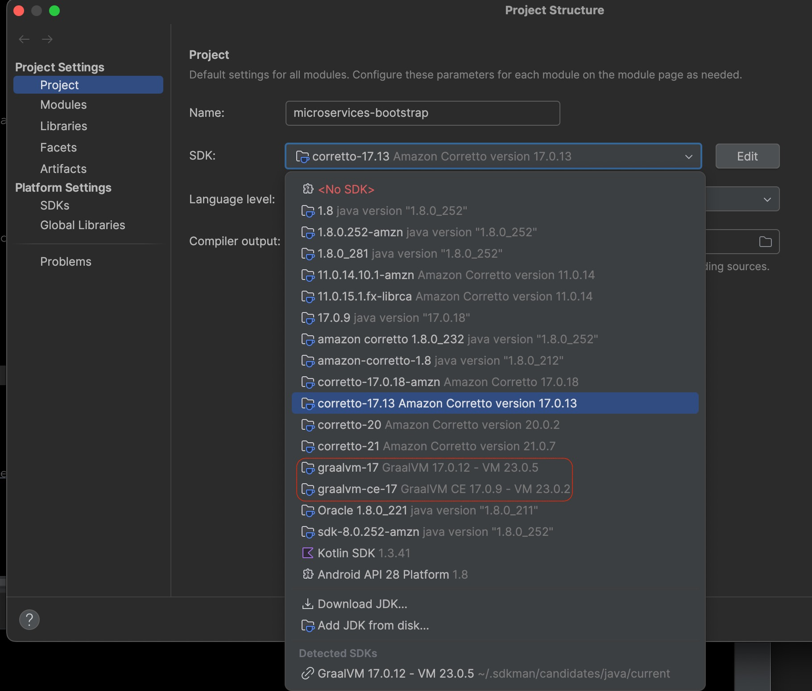
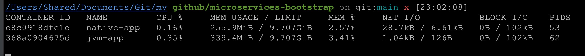
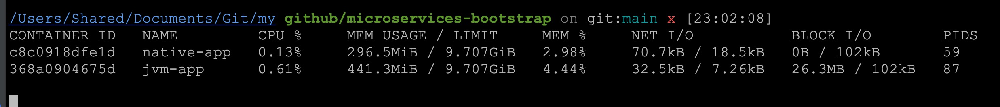

# Building a Spring Boot Microservice as a GraalVM Native Image

A practical, from-the-trenches guide to converting this [microservices-bootstrap app](https://github.com/sam888/microservices-bootstrap), a Spring Boot 3.5 reactive microservice (WebFlux + WebClient) into a GraalVM native image — written up from the changes in commit [`c28539e`](https://github.com/sam888/microservices-bootstrap/commit/c28539e69b266e8ad70c6af0a4f41c7b75b509c3).

---

## Motivation

This project calls several downstream REST APIs (Westpac FX rates, an auth
service, a transaction/card service) through reactive `WebClient`s. It's a
typical candidate for containerized deployment — and a typical candidate for
GraalVM native compilation, because:

- **Cold start matters.** In a microservices/Kubernetes world, pods scale up
  and down constantly. It's common for a production JVM app to take 30~60 seconds (or even longer) to reach steady state; a native image typically starts in just a few seconds.
- **Memory is money.** Cloud billing is often memory-hours. A native image
  commonly uses a fraction of the RSS (Resident Set Size) of the equivalent JVM process, which lets you pack more instances per node (or use smaller nodes).
- **It's a good way to actually learn AOT compilation trade-offs** — reflection,
  dynamic proxies, and classpath scanning all "just work" on the JVM but need
  to be explicitly declared for ahead-of-time (AOT) compilation. Wiring this
  up for a real reactive Spring Boot service (not a toy "Hello World") is
  where the interesting problems show up.

This write-up documents exactly what had to change in `build.gradle` and in
application code to get `./gradlew nativeCompile` producing a working native
binary for this service — including the errors hit along the way and how
they were diagnosed.

---

## Tech Stack

| Tool                                       | Version used in this repo                 | Notes                                                                                            |
| ------------------------------------------ | ----------------------------------------- | ------------------------------------------------------------------------------------------------ |
| Spring Boot                                | 3.5.14                                    | Native image support is built in via `spring-boot-starter-parent`/AOT processing                 |
| GraalVM Native Build Tools (Gradle plugin) | `org.graalvm.buildtools.native` 0.10.6    | Provides the `nativeCompile` / `nativeRun` tasks                                                 |
| GraalVM JDK                                | 17 or 21 (Oracle GraalVM or Liberica NIK) | Must be the active JDK when running `nativeCompile` — this is a **compiler**, not just a runtime |
| Gradle                                     | 8.x                                       | Required for the native build tools plugin version above                                         |

> **Note:** you need a GraalVM distribution installed locally (or in CI), with  
> `JAVA_HOME` pointed at it — this project's `toolchainDetection = false`  
> setting (see [Configuration](#configuration) below) means Gradle uses whatever GraalVM 
> `JAVA_HOME` points to, rather than auto-detecting one itself. Having 
> `native-image` on your `PATH` as well is useful for running  it directly 
> (e.g. `native-image --version` to check the edition) — but Gradle itself never 
> checks `PATH`; only `JAVA_HOME` affects whether `nativeCompile` finds the right tool.

---

## GraalVM Community Edition vs. Oracle GraalVM (Production Considerations)

"GraalVM" isn't one single thing — there are two distributions, and the
choice matters for anyone shipping this to production, not just for local
development.

|                            | GraalVM Community Edition (CE)                                                                 | Oracle GraalVM                                                                                                                                                                    |
| -------------------------- | ---------------------------------------------------------------------------------------------- | --------------------------------------------------------------------------------------------------------------------------------------------------------------------------------- |
| License                    | Open source — GPLv2 with Classpath Exception                                                   | Free to use (including production) under Oracle's GraalVM Free Terms and Conditions (GFTC) — but **not open source**                                                              |
| Cost                       | Free, no restrictions                                                                          | Free under GFTC, but "free" ≠ unrestricted — GFTC prohibits things like using it to build a competing product, and includes usage terms worth having reviewed                     |
| Native image optimizations | Standard AOT compilation, Serial GC only                                                       | Adds **Profile-Guided Optimization (PGO)**, the **G1 garbage collector** inside the native binary, and **ML-based profile inference** (`-O3`) — none of which are available in CE |
| Typical fit                | Most teams, cost-sensitive projects, anyone who wants a fully open-source toolchain end to end | Teams that specifically need the extra native-image performance headroom (PGO/G1/`-O3`) and are comfortable with Oracle's GFTC terms                                              |

**Why this matters beyond licensing paperwork:** the performance numbers
often quoted for GraalVM native images in blog posts and benchmarks (better
throughput matching or exceeding the JVM, lower GC pause times under load)
frequently come from builds using Oracle GraalVM's PGO and G1 GC — not from
GraalVM Community Edition. If you build with CE and don't see those exact
numbers, that's expected, not a sign something's misconfigured: CE gets you
the startup-time and memory wins, but the throughput-optimization tooling
is an Oracle GraalVM-only feature.

**For this project**, either edition is a reasonable starting point — CE if
you want to avoid any GFTC license review, Oracle GraalVM if you want to
experiment with PGO later. This isn't legal advice; if you're deploying at
an organization with a procurement/legal process, that's worth a quick
conversation before picking a distribution for production use. 

### How to check which edition you're actually running

`build.gradle` doesn't declare an edition — the native build tools plugin
just calls whatever `native-image` binary it finds via `JAVA_HOME`
(`toolchainDetection = false` in build.gradle makes this explicit: it's
using your active `JAVA_HOME`, not auto-detecting or pinning anything). So
the edition is a property of your environment, not the build file, and it's
worth verifying on both your local machine and your CI runner, since nothing
stops the two from silently drifting apart.

```bash
native-image --version
```

Example output from a machine running Oracle GraalVM:

```
native-image 17.0.12 2024-07-16
GraalVM Runtime Environment Oracle GraalVM 17.0.12+8.1 (build 17.0.12+8-LTS-jvmci-23.0-b41)
Substrate VM Oracle GraalVM 17.0.12+8.1 (build 17.0.12+8-LTS, serial gc, compressed references)
```

The line to look at is the second one: **`Oracle GraalVM`** means you're on
the Oracle distribution (GFTC license). Community Edition instead prints
something like `GraalVM CE` in that line. Note that `serial gc` in the third
line just means this particular binary is currently *configured* to use the
default GC — Oracle GraalVM still makes G1 GC and PGO available as opt-in
`buildArgs`, so seeing `serial gc` doesn't tell you which GC edition you're on,
only which GC flag (or lack of one) is currently set.

**Why isn't the edition just pinned in `build.gradle` as a toolchain requirement?**
Gradle does support requesting a JVM vendor for a toolchain (`vendor =
JvmVendorSpec.matching("GraalVM Community")`), but this doesn't currently
work for pinning **Oracle GraalVM** specifically. Gradle's built-in
`JvmVendorSpec.GRAAL_VM` constant only maps to GraalVM CE, and Oracle
GraalVM's `java.vendor` property is simply `"Oracle Corporation"` —
identical to a plain Oracle JDK, with nothing that distinguishes it. This is
a known, currently-open gap in Gradle's toolchain support, not a mistake in
this project's config. It's also the real reason build.gradle has:

```groovy
toolchainDetection = false  // use JAVA_HOME instead of auto-detect
```

That line is the native-build-tools plugin's escape hatch for exactly this problem: instead of asking Gradle to auto-resolve and download a matching GraalVM toolchain, it just uses whichever `native-image` is already active on `JAVA_HOME`. That auto-resolution path matters because of what it relies on: Gradle downloads JDKs it doesn't already have via Foojay, short for "Friends of OpenJDK," a JDK-discovery service — and that means reaching its Disco API over the network, something that's often blocked on corporate CI runners. Skipping toolchain detection entirely sidesteps that dependency. In practice, that pushes edition selection out of `build.gradle` entirely and into the environment — which is exactly what the Dockerfile does, below.

### How this is actually pinned in practice: the Dockerfile

Since `build.gradle` can't reliably pin an GraalVM edition, the real source of truth
for a reproducible build is the container image used to build it. This
project's `Dockerfile-native` file does exactly that:

```dockerfile
# Stage 1: Build the native image using GraalVM CE
FROM ghcr.io/graalvm/native-image-community:17 AS build
WORKDIR /app

COPY .git /app/.git
RUN microdnf install -y findutils && microdnf clean all

COPY gradlew /app/
COPY gradle /app/gradle
COPY build.gradle settings.gradle /app/
COPY src /app/src

RUN ./gradlew nativeCompile --no-daemon -x test

# Stage 2: Final production-ready image
FROM debian:bookworm-slim
WORKDIR /app
COPY --from=build /app/build/native/nativeCompile/microservices-bootstrap /app/microservices-bootstrap
RUN chmod +x /app/microservices-bootstrap
RUN groupadd -g 1001 spring && useradd -u 1001 -g spring -s /bin/false spring
RUN chown spring:spring /app/microservices-bootstrap
USER 1001
EXPOSE 8080
ENTRYPOINT ["./microservices-bootstrap"]
```

The `FROM ghcr.io/graalvm/native-image-community:17` line **is** the edition
pin (GraalVM CE is pinned)  — the tag fixes both the GraalVM edition and the JDK feature version for anyone (or any CI runner) building this image, with no ambiguity about what
`JAVA_HOME` happens to point to on that machine. This is also why the multi-stage build 
matters here: the first stage needs the full GraalVM build toolchain to run `nativeCompile`, 
but the second stage only needs a minimal Linux base (`debian:bookworm-slim`) to run the already-compiled binary — the GraalVM image itself never ships in the final container.

**Building and running it:**
```bash
# Build the image (run from the repo root, since the Dockerfile COPYs .git,
# gradlew, and src relative to the build context — the trailing `.`)
docker build -f Dockerfile-native -t microservices-bootstrap-native .

# Run the resulting container
docker run -p 8081:9090 microservices-bootstrap-native
```
`-f Dockerfile-native` points Docker at this file instead of the default `Dockerfile`; `-t` tags the built image with a name; the trailing `.` sets the build context to the current directory. That last part matters more than it looks: because the first stage does `COPY .git /app/.git`, the build has to be run from the repo root (where `.git` actually lives), not from some other working directory — and if a `.dockerignore` is ever added to this project, it needs to not exclude `.git`, or that copy step (and whatever `git-properties` uses it for at `/actuator/info`) will silently break.

**One thing worth double-checking in this project specifically:**
`native-image-community` is a **GraalVM Community Edition** image — CE
images are published on GitHub Container Registry (`ghcr.io/graalvm/...`),
while Oracle GraalVM images are published separately on Oracle's own
registry (`container-registry.oracle.com/graalvm/native-image:17`). That
means the Docker build in this repo currently compiles with **GraalVM CE**,
while a local `native-image --version` check (see above) showed **Oracle
GraalVM** on the machine that ran it manually. Both editions will happily
build this project, but it's worth deciding intentionally which one is the
"real" build environment — otherwise you can end up debugging a native-image
failure locally under one edition that doesn't reproduce (or that only
reproduces) in CI under the other.

**Which one should you actually pick?** "Free" and "no catch" aren't quite
the same thing, so it's worth being precise about what Oracle GraalVM's
GFTC license actually commits to versus what it doesn't:

- **The free-updates window is tied to the LTS cycle, not indefinite per
  version.** Oracle commits to free GFTC security updates for an LTS (like
  JDK 17) only *until one year after the next LTS ships* — after that,
  staying patched on that exact version may require an Oracle Java SE
  subscription. GraalVM CE has no such expiry; it stays open source
  regardless of Oracle's commercial release cadence.
- **It's free, but not open source**, and redistribution is only permitted
  "as long as it is not for a fee" — a real condition, even if it doesn't
  affect most projects.
- **Support runs through a different channel** — Oracle GraalVM bugs go via
  My Oracle Support rather than public GitHub Issues, which matters less
  for a portfolio project but is worth knowing for a team evaluating this
  for production.
- **Some organizations have blanket "open-source only" policies** for build
  tooling. Under that kind of policy, GFTC doesn't qualify regardless of
  price — a real, if not universal, reason some teams default to CE anyway.

None of this makes Oracle GraalVM a bad choice — the extra native-image
optimizations (PGO, G1 GC, `-O3`) are a legitimate reason to prefer it, and
it's genuinely free for commercial and production use `today`. The nuance is
just that "free" here means "free under a specific, time-bound, non-open-
source license," not "functionally identical to open source, just made by
Oracle".

### Picking the edition locally: your IDE's SDK picker

There are actually **three separate places** where the GraalVM edition gets
decided for this project, and it's easy for them to quietly drift apart:

1. **Your terminal's `JAVA_HOME`** — what `native-image --version` reports
   when you run it directly (see above).
2. **The Docker build's `FROM` line** — what CI/production actually
   compiles with (see the Dockerfile section above).
3. **Your IDE's configured Project SDK** — what runs when you trigger
   `nativeCompile` (or any Gradle task) from inside IntelliJ rather than a
   terminal.

That third one is easy to overlook. If you manage multiple JDKs locally
(e.g. via SDKMAN), IntelliJ's **Project Structure → SDK** picker will often
list several GraalVM installs side by side — including both editions, if
you have both installed:

<a href="images/idea-project-structure-sdk.png">

</a>

In this example, `graalvm-17` (`GraalVM 17.0.12`) is the **Oracle GraalVM**
build, and `graalvm-ce-17` (`GraalVM CE 17.0.9`) is the **Community
Edition** build — both installed and both selectable for the same project.
Whichever one is selected here is the JDK IntelliJ hands to Gradle when you
run tasks from the IDE, independent of whatever `JAVA_HOME` is set to in a
plain terminal shell.

**Practical takeaway:** if you ever hit a native-image failure that "only
happens sometimes," it's worth checking that all three of these — terminal
`JAVA_HOME`, IDE Project SDK, and the Docker base image — are actually
pointing at the same GraalVM edition and version before assuming it's a
code problem. A mismatch between any two of them is a common, easy-to-miss
source of "works on my machine" native-image bugs.

---

## Configuration

### 1. Add the plugin and dependencies to `build.gradle`

```groovy
plugins {
    ....
    id 'org.graalvm.buildtools.native' version '0.10.6'  // ✅ add this
}
```

### 2. Configure the `graalvmNative` block

This is the block that actually drives `nativeCompile`. Every `buildArgs.add(...)`
here is a flag being passed straight to the underlying `native-image` tool.

```groovy
graalvmNative {
    toolchainDetection = false  // use JAVA_HOME instead of Gradle's auto-detection
    binaries {
        main {
            imageName = 'microservices-bootstrap'
            mainClass = 'com.microservices.bootstrap.MainApplication'
            buildArgs.add('--no-fallback')  // fail the build if a full native image isn't possible

            // Fixes: "Classes that should be initialized at run time got
            // initialized during image building: org.apache.commons.logging.LogFactory..."
            buildArgs.add('--initialize-at-build-time=org.apache.commons.logging.LogFactory')

            buildArgs.add('--initialize-at-run-time=ch.qos.logback,org.apache.logging.log4j,org.slf4j,org.apache.commons.logging.impl.Jdk14Logger')
            buildArgs.add('--initialize-at-run-time=org.springframework.data.repository.util.QueryExecutionConverters,org.springframework.data.util.CustomCollections')

            buildArgs.add('-H:+ReportExceptionStackTraces')
            buildArgs.add('-H:+ReportUnsupportedElementsAtRuntime')

            // Explicitly include AOT-generated classes
            classpath(sourceSets.aot.output.classesDirs)

            // Always use fast build locally. The valid optimize options for GraalVM 17 are:
            // Flag    Meaning
            // -O0No   optimizations (fastest build, good for dev)
            // -O1     Basic optimizations
            // -O2     Default -> the default when no flag is specified, exactly what's used for production
            // -Ob     Optimize for fastest build time. ~43% build speedup according to Oracle benchmark
            //
            // Fast local builds: -Ob trades runtime performance for ~40% faster compiles
            if (project.hasProperty('localDev')) {
                buildArgs.add('-Ob')  // usage: ./gradlew nativeCompile -PlocalDev
            }
        }
    }
}

configurations {
    compileOnly {
        extendsFrom annotationProcessor
    }
    all {
        exclude group: 'commons-logging', module: 'commons-logging'
    }
}

tasks.register('runNative', Exec) {
    commandLine "./build/native/nativeCompile/microservices-bootstrap"
}
```

A few things worth calling out for anyone reading this cold:

- **`--no-fallback`** is important during development — without it,
  `native-image` will silently fall back to a JVM-based "fallback image"
  if it can't fully compile, which defeats the purpose and hides real
  problems until deployment.
- **`--initialize-at-run-time`** is the fix for most "class was
  unintentionally initialized at build time" errors. Static initializers
  (like logging framework setup) that touch environment/filesystem state
  need to run at native image *runtime*, not at *build* time on the machine
  compiling the image.
- Excluding `commons-logging` avoids classpath conflicts between it and
  SLF4J/Logback under native image, which is a common source of duplicate
  logger initialization.

### 3. Register reflection hints for DTOs used via `WebClient`

Spring's AOT processing engine can't statically see that `WebClient`
serializes/deserializes `WestpacRateRequestDTO` and `WestpacRateResponseDTO`
via Jackson at runtime — from a native image's point of view, reflection and
dynamic class access don't exist unless you declare them.

`WestpacClient.java`:

```java
@Slf4j
@Service
@RegisterReflectionForBinding({ WestpacRateRequestDTO.class, WestpacRateResponseDTO.class })
public class WestpacClient {

    private final WebClient westpacWebClient;

    public WestpacClient(WebClient westpacWebClient) {
        this.westpacWebClient = westpacWebClient;
    }

    public Mono<WestpacRateResponseDTO> getUsdRateByWestpac(){
        WestpacRateRequestDTO westpacRateRequestDTO = getWestpacRateRequestDTO("USD");
        log.info("westpacRateRequestDTO: " + westpacRateRequestDTO);
        return westpacWebClient
              .post()
              .accept(MediaType.APPLICATION_JSON)
              .body(Mono.just(westpacRateRequestDTO), WestpacRateRequestDTO.class)
              // ...
    }
}
```

`@RegisterReflectionForBinding` tells Spring's AOT engine to generate the
necessary entries in `reflect-config.json` (and related resource metadata) at
build time, so Jackson can still construct and populate these DTOs via
reflection inside the native image. Without this annotation, the app builds
fine but throws `NoSuchMethodException` / silent (de)serialization failures
at runtime — one of the more frustrating GraalVM failure modes because the
build itself succeeds.

The same clients were also refactored to take `WebClient` as a constructor
argument (via a shared `WebClientConfig` bean) instead of building their own
`WebClient` internally from a `@Value`injected URL. This isn't strictly a
GraalVM requirement, but constructor injection of pre-built beans is
generally more AOT-friendly than doing config-driven object construction
inside a class Spring also has to process for AOT.

### 4. Handling reflection for *third-party* dependencies: the Reachability Metadata Repository (optional)

`@RegisterReflectionForBinding` above solves reflection hints for classes
**you own**. It does nothing for a third-party library in your dependency
tree that uses reflection internally — you can't add an annotation to code
you didn't write. For that case, GraalVM maintains a shared, community-
sourced [Reachability Metadata Repository](https://github.com/oracle/graalvm-reachability-metadata):
a collection of pre-written `reflect-config.json` / `resource-config.json`
files for popular libraries that don't ship native-image support out of the
box.

**This is opt-in, not on by default — and that's deliberate, not an
oversight.** Before wiring it in, it's worth understanding why:

- **It's officially labeled experimental** by GraalVM's own documentation,
  not presented as a settled best practice.
- **It's a live debate even among the plugin's maintainers.** There's an
  open proposal on the native-build-tools project to make it default-on
  precisely *because* it currently isn't — as of this writing, that's still
  a proposal, not shipped behavior.
- **Reproducibility:** enabling it without pinning a version means your
  build fetches whatever the shared repository currently contains. Build
  the same commit today and again in three months, and you could get two
  different native images, because the metadata source moved underneath
  you — not because your code changed. Pinning a version (below) is how you
  avoid this.
- **It's a build-time network dependency.** Enabling it means `nativeCompile`
  reaches out to GitHub to fetch metadata. Fine for most CI setups, but
  worth flagging for locked-down or air-gapped build environments.
- **It's a trust boundary.** You're pulling in reflection/resource
  configuration for your dependencies that was written by the community or
  Oracle, not by you or the library authors — usually exactly what you
  want, but a different category of "who wrote this config" than your own
  `@RegisterReflectionForBinding` annotations.

**How to actually enable it — confirmed working configuration:**

```groovy
graalvmNative {
    toolchainDetection = false
    binaries {
        main {
            // ... existing config from above
        }
    }
    metadataRepository {
        enabled = true
        // No `version` pinned here (github.com/oracle/graalvm-reachability-metadata/releases)
		// on purpose: This is tested to work. Attempting to pin an explicit version copied from
		// the metadata repo's GitHub Releases page (e.g. "1.0.15") failed here with:
		// NoSuchFileException: .../exploded/index.json
		// — the plugin's internal version scheme doesn't line up with the
		// repo's public release tags, so an explicit version can silently
		// point at something that doesn't exist. If you want to
		// investigate pinning anyway, run with `--info` and grep for the
		// actual download URL the plugin requests, rather than guessing a
		// version number from the GitHub Releases page.
    }
}
```
**The trade-off of skipping `version`:** you lose strict "identical metadata forever" reproducibility — a different native-build-tools plugin version could ship a different bundled default. In exchange, you get something that reliably works: the default is guaranteed compatible with _this_ plugin version, since that's what it was tested against. For a project this size, that trade-off is reasonable.

Once enabled, `nativeCompile` automatically:

1. Downloads the plugin's bundled-compatible metadata release.
2. Cross-references it against your project's actual resolved dependencies
   (whatever Gradle sees from `implementation`, `compileOnly`, etc.).
3. For every dependency with a matching entry, applies that library's
   reflection/resource config to the native-image build — no manual file
   copying required.

**No manual cloning or file-copying is involved at any point.** If you find
yourself looking at that repository's [own `build.gradle`](https://github.com/oracle/graalvm-reachability-metadata/blob/master/build.gradle), that's the
repository's *internal* tooling for testing its own metadata against sample
apps — it's not an example of how a consuming project should use it. The
`metadataRepository { }` block above is the entire integration surface.

**If a dependency isn't covered by the repo** (coverage isn't universal —
check the repo's `metadata/` folder on GitHub for your specific library),
fall back to the same tools used for your own code:
- Run the **Tracing Agent** against a JVM-mode run of your app
  (`-Pagent=standard`, then `./gradlew metadataCopy`) to auto-generate
  config for that dependency.
- Or hand-write JSON under
  `src/main/resources/META-INF/native-image/<group>/<artifact>/` —
  `native-image` scans that exact path convention automatically at build
  time.

**Bottom line recommendation for this project:** enabling it with a pinned
version is reasonable if a native-image build fails on a reflection error
coming from a dependency (rather than your own code) and that dependency
turns out to be listed in the repo. It's not something to flip on
speculatively "just in case" — add it when you actually hit that specific
failure mode, and pin the version when you do.

---

## Pros and Cons

### Pros
- **Fast startup** — this project's native image logs show native binary app starts in `2.26 seconds` while JVM image logs show JVM app starts in `10.284 seconds`!
- **Lower memory footprint** — no JIT compiler, no interpreter, no bytecode
  metadata sitting in memory at runtime.
- **Smaller attack surface** — dead code elimination at build time means
  unused classes/reflection paths simply aren't in the binary.
- **Predictable performance from the first request** — no JIT warm-up curve,
  which is nice for latency-sensitive endpoints that get hit immediately
  after a deploy.

### Cons
- **Build time is long** — native compilation is a heavyweight, single-JVM
  static analysis + compilation process. A build that takes 30 seconds with
  `bootJar` can take several minutes with `nativeCompile`. It took 4m 22s to run `nativeCompile` for this project in my 3.2 GHz 6-Core Intel Core i7 machine!
- **Reflection, proxies, and resources must be explicitly declared** — every
  library using reflection, dynamic proxies, or classpath resource scanning
  the "normal" JVM way potentially needs GraalVM hints (`reflect-config.json`,
  `resource-config.json`, `proxy-config.json`) or Spring AOT annotations.
- **Debugging is different** — no live JIT, no easily-attached JVM debugger
  by default, and stack traces / heap analysis tools you're used to don't
  apply the same way.
- **Not worth it for local dev loop** — you don't want to `nativeCompile`
  every time you save a file. Native image is a *deployment artifact*, not a
  dev-loop tool. Keep using `bootRun` locally and reserve `nativeCompile` for
  CI/CD and pre-deployment builds (the `-PlocalDev` / `-Ob` flag above is a
  concession to this when you do need to test a native build locally).
- **Third-party library support varies** — some libraries (older ones
  especially) don't ship GraalVM reachability metadata and need manual
  configuration or aren't native-image compatible at all.

**Bottom line:** build native images for staging/production deployment
artifacts and CI pipelines; keep the fast JVM `bootRun` loop for day-to-day
development.

---
## Benchmarking Memory Usage: JVM Container vs. Native Image Container

The "lower memory footprint" claim above is easy to assert and easy to overstate — industry benchmarks for GraalVM native images commonly cite 50–80% reductions, but that range is highly dependent on the specific app, dependencies, and workload. Rather than borrow someone else's number, here's the actual comparison for **this** project's two Docker images.

### How this was measured

Both images were built from this repo — the JVM image via the standard `bootJar`-based Dockerfile, and the native image via `Dockerfile-native` (see [Configuration](#configuration) above) — then run as separate containers so their memory could be compared side by side with `docker stats`:


### Run both containers with fixed names so they can be queried together

```bash
# Run both containers with fixed names so they can be queried together
docker run -d --name jvm-app -p 8080:9090 microservices-bootstrap-jvm
docker run -d --name native-app -p 8081:9090 microservices-bootstrap-native

# Take a single snapshot (rather than a continuously streaming one)
# right after both containers report as started
docker stats --no-stream jvm-app native-app
```

`docker stats` reports memory as `MEM USAGE / LIMIT` — the number before the slash is the one that matters here; the limit is only relevant if one was explicitly set on the container.

Two snapshots are worth taking, since they tell different parts of the story:

1. **Idle, immediately after startup** — shows the raw baseline footprint difference before any request has been handled.
2. **After sending a handful of requests** — the JVM's memory usage typically climbs from its idle baseline as classes get JIT-compiled and the heap grows to accommodate live objects; the native image's usage tends to stay comparatively flat, since there's no JIT and no bytecode metadata to accumulate.

#### Idle memory (immediately after startup)

<a href="images/idle-memory.jpg">

</a>

#### Memory after a few requests

<a href="images/memory-after-requests.png">

</a>

### Results

|                                                  | JVM (`bootJar`, Docker) | Native Image (Docker) | Reduction    |
| ------------------------------------------------ | ----------------------- | --------------------- | ------------ |
| Image size (`CONTENT SIZE`)                      | 212MB                   | 115MB                 | ~46% smaller |
| Startup time (Spring Boot's own logged duration) | 10.284s                 | 2.26s                 | ~78% smaller |
| Idle memory (immediately after startup)          | 339.4MB                 | 255.9MB               | ~25% smaller |
| Memory after a few requests                      | 441.3MB                 | 296.5MB               | ~33% smaller |
Note:
* Content size obtained by command:  `docker images`
* JVM Docker startup time:  `docker logs jvm-app | grep -i started`
* Native Image Docker startup time: `docker logs native-app | grep -i started`
* Memory usage of JVM and Native Image: `docker stats`

Numbers above are from running both containers on 3.2 GHz 6-Core Intel Core i7. Results will vary by hardware and JVM heap settings — these are not industry averages, they're what this specific project measured.

---
## Troubleshooting

Native image build failures are almost always one of two categories:
**"class initialized at build time that shouldn't be"** or **"missing
reflection/resource metadata."** Here's the workflow used on this project.

### 1. "Classes that should be initialized at run time got initialized during image building"

This was the first error hit, for `org.apache.commons.logging.LogFactory`. The full error is worth reading carefully, because one word in it is the key to the fix:

```
Error: Classes that should be initialized at run time got initialized during
image building: org.apache.commons.logging.LogFactory was unintentionally
initialized at build time.
```

**"Unintentionally" is the actual complaint** — not "build time is always wrong for this class." `native-image` doesn't forbid build-time initialization outright; it flags any class that got initialized as a side effect of its build-time static analysis _without you explicitly deciding that_, because an undeclared choice is exactly what causes broken/stale behaviour at runtime. The fix isn't automatically "switch it to run-time init" — it's "make the initialization timing an explicit, deliberate choice" — and either flag can be the right answer, depending on the class.

```groovy
buildArgs.add('--initialize-at-build-time=org.apache.commons.logging.LogFactory')
```

This is the right call for `LogFactory` because its static initialization doesn't depend on anything the runtime environment provides — it's safe to resolve once, at build time. Declaring that explicitly satisfies the "unintentional" complaint, because now it's a decision, not a side effect.

That's _not_ the general rule for logging classes, though — most of them (Logback, Log4j, SLF4J) do reference runtime-sensitive state, so the broader fix for the rest of the logging stack was the opposite: forcing them to run-time init instead:

```groovy
buildArgs.add('--initialize-at-run-time=ch.qos.logback,org.apache.logging.log4j,org.slf4j,org.apache.commons.logging.impl.Jdk14Logger')
```

So this isn't "the fix contradicts the error" — it's "the error demands a deliberate choice, and different classes in the same logging stack legitimately need opposite choices."

### 2. Tracing *why* a class got initialized early

When the error message alone doesn't make it obvious what's pulling a class
in at build time, add a temporary trace flag:

```groovy
buildArgs.add('--trace-class-initialization=ch.qos.logback.classic.Logger')
```

This prints the exact call chain that triggered `Logger`'s static
initializer during the build, which is far more useful than guessing. In
this project it traced back to **Spring Data's
`QueryExecutionConverters`**, fixed by adding it (and its sibling
`CustomCollections`) to the run-time init list:

```groovy
buildArgs.add('--initialize-at-run-time=org.springframework.data.repository.util.QueryExecutionConverters,org.springframework.data.util.CustomCollections')
```

**Remove `--trace-class-initialization` once you've diagnosed the issue** —
it's a diagnostic flag, not something you want in a normal build.

### 3. Missing reflection metadata for JSON DTOs

Symptom: the native build *succeeds*, but at runtime you get serialization
failures, empty JSON payloads, or `NoSuchMethodException` when a `WebClient`
call tries to marshal/unmarshal a DTO.

Fix: annotate the class doing the (de)serialization with
`@RegisterReflectionForBinding({...})`, listing every DTO involved (see
[3. Register reflection hints for DTOs used via `WebClient`](### 3. Register reflection hints for DTOs used via `WebClient`) above
above). This generates the equivalent of a `resource-config.json`/
`reflect-config.json` entry automatically via Spring AOT, instead of you
hand-writing GraalVM's native reachability metadata JSON files yourself.

### 4. General-purpose flags worth always having on during development

```groovy
buildArgs.add('-H:+ReportExceptionStackTraces')
buildArgs.add('-H:+ReportUnsupportedElementsAtRuntime')
```

These make native-image failures print full stack traces and flag
unsupported-at-runtime elements instead of failing silently or cryptically —
turn them on early rather than after you're already stuck.

### 5. Builds taking ~45–60 minutes on Apple Silicon (M-series) Macs

If you're developing on an M1/M2/M3/M4 Mac and a amd64 native build that should
take a few minutes in amd64 PC (both 64-bit Intel and AMD processors) is instead taking the better part of an hour (e.g. `docker build --platform linux/amd64 -f Dockerfile-native -t microservices-bootstrap-native .`), this is almost always an architecture mismatch problem, not a config problem.

**The root cause:** `native-image` is not a cross-compiler. It doesn't
produce a portable artifact the way a JAR is portable — it compiles a
binary for the exact OS and CPU architecture of the machine running the
build. Build on an M-series Mac directly, and you get a `macOS/arm64`
binary. That's fine for testing locally, but it's **not** what you want to
deploy to a typical EKS node group, which usually runs `linux/amd64` (unless
you're specifically using Graviton/arm64 node groups).

**Why that forces emulation:** to produce a `linux/amd64` binary from a Mac,
the build has to run inside a `linux/amd64` container. Docker Desktop on
Apple Silicon runs those containers by emulating an x86-64 CPU (via QEMU, or
Rosetta if you've enabled it) on top of the Mac's arm64 hardware. Running
*any* heavy compilation under CPU emulation is slow — and `native-image` is
an especially heavy, CPU- and memory-intensive static-analysis-plus-AOT-
compilation process. Emulating that instruction-by-instruction is what turns
a native build that'd take 4–7 minutes on real x86-64 hardware into 45+
minutes on an emulated Mac.

**How to actually fix it, rather than just wait it out:**
- **Build where the target actually runs.** Push `nativeCompile` into your
  CI/CD pipeline running on real `linux/amd64` runners (GitHub Actions'
  standard Linux runners, an EC2 build agent, etc.) instead of running it
  locally on your Mac. CI/CD pipeline is the right home for native builds
  regardless of your laptop's architecture, it *specifically* fixes
  this problem for Apple Silicon users.
- **If you need to test a native build locally,** use a remote amd64 build
  box (a small EC2 instance, a Linux dev machine, etc.) rather than
  emulating amd64 on your Mac.
- **Check what architecture your EKS nodes actually run.** If your cluster uses Graviton (arm64) node groups, you don't need amd64 at all — you can build natively for arm64 on your Mac at full speed, and it'll match what Kubernetes deploys. The slow path only happens when the build architecture and the target architecture _don't_ match. The reliable way to check is:
  
```bash
kubectl get nodes -L kubernetes.io/arch
```
which adds a dedicated `ARCH` column present on every node regardless of OS image:

```
  NAME       STATUS   ROLES    AGE   VERSION   ARCH
  node-1     Ready    <none>   10d   v1.28.0   amd64
  node-2     Ready    <none>   10d   v1.28.0   arm64
```

### 6. Speeding up the local iteration loop

Full optimization (`-O2`, the default) is slow to compile. For local
sanity-checks of a native build (not for anything you'll actually deploy),
use:

```bash
./gradlew nativeCompile -PlocalDev
```

which activates `-Ob` (optimize for build speed) via the `project.hasProperty('localDev')`
check in the config above.

| Flag  | Meaning                                                                  |
| ----- | ------------------------------------------------------------------------ |
| `-O0` | No optimizations — fastest build, good for a quick sanity check          |
| `-O1` | Basic optimizations                                                      |
| `-O2` | Default — used for production builds                                     |
| `-Ob` | Optimize for build time (~40% faster builds per Oracle's own benchmarks) |

---

## Testing

- **Unit/integration tests still run on the JVM**, not against the native
  binary — `nativeCompile` builds a deployment artifact, it isn't part of
  the normal test task. (In this project, `tasks.named('test') { enabled =
  false }` was actually set as a build-speed measure for CI — if you're
  following along, keep JVM tests enabled unless you have a specific reason
  not to.)
- **Regression-test the actual binary** after building it with tools like Postman, since some failures (missing reflection config, resource loading issues) only surface at
  native runtime, never during `nativeCompile` or JVM tests. This is when your automated regression test suite really shine if there is one
- **GraalVM Native Build Tools also supports `./gradlew nativeTest`**, which
  compiles your test classes into a native test binary and runs them
  natively — useful as a stronger guarantee than JVM tests that reflection
  configuration is complete, at the cost of a much slower test-build cycle.
  Reserve it for CI, not for every local run.
- Hit the actual downstream-calling endpoints (e.g. the Westpac rate lookup)
  once the binary is running, since DTO serialization problems are exactly
  the class of bug that JVM tests won't catch but a real native-mode HTTP
  call will.

---

## Final Thoughts

Getting a real, non-trivial Spring Boot service (reactive `WebClient`,
Redis, Resilience4j, Spring Data) onto GraalVM native image is mostly about
patiently working through a short, repeatable diagnostic loop:

1. Run `nativeCompile`.
2. Read the error.
3. If it's a class-initialization-timing error → use
   `--trace-class-initialization` to find the real culprit, then fix it with
   `--initialize-at-run-time` (or occasionally `--initialize-at-build-time`).
4. If it's a missing-reflection/serialization error at runtime → add
   `@RegisterReflectionForBinding` (or hand-write GraalVM hint JSON for
   non-Spring-managed classes).
5. Repeat.

None of these fixes are exotic — they're all standard, documented GraalVM/
Spring AOT mechanisms — but there's no substitute for actually hitting the
errors on a real project with real dependencies (Logback, Spring Data,
Resilience4j, Jackson-backed WebClient calls) to learn where the friction
points are. That's the main value of this write-up: it's not a "Hello World"
native image guide, it's what changed on a genuine multi-client reactive
microservice.

### What's next
- **Enable the Reachability Metadata Repository if a third-party dependency
  ever breaks under `nativeCompile`** — see Configuration above for exactly how 
  to enable it (with a pinned version), why it's opt-in rather than default, and what 
  to do if a dependency isn't covered.
- **Add `nativeTest` as a CI check**, not just `nativeCompile`. Normal
  `./gradlew test` runs your test suite on the regular JVM — which means it
  can pass even when the *native* build is actually broken, because
  reflection/serialization issues (like the one fixed on `WestpacClient`)
  often only surface when code runs in native mode. `./gradlew nativeTest`
  compiles the test suite into an actual native binary and executes it that
  way, so it catches those failures automatically instead of relying on
  manually curling the running binary after every change. It's slower than
  a normal test run, which is exactly why it belongs in CI rather than in
  the local dev loop.
- Wire `nativeCompile` or a Docker file (i.e., Dockerfile-native) into CI and publish the resulting binary inside a minimal container image — this is where the memory and startup - time wins actually get realized in production, since the native binary needs no JVM base image at all.

---

## References

- [Spring Boot GraalVM Native Image Support](https://docs.spring.io/spring-boot/reference/packaging/native-image/index.html)
- [GraalVM Native Build Tools (Gradle plugin)](https://graalvm.github.io/native-build-tools/latest/gradle-plugin.html)
- [GraalVM Reachability Metadata Repository](https://github.com/oracle/graalvm-reachability-metadata)
- Commit referenced in this guide: [`c28539e`](https://github.com/sam888/microservices-bootstrap/commit/c28539e69b266e8ad70c6af0a4f41c7b75b509c3)
